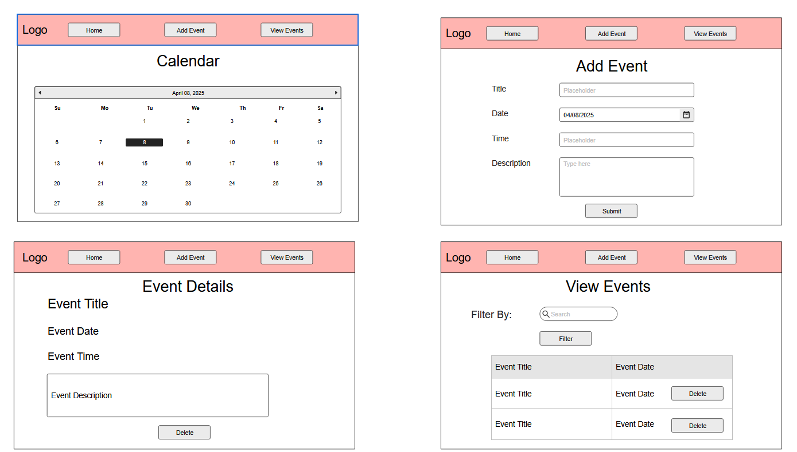

# CS408 Final Project - Calendar App

## Project Spec

### General Theme

The theme of this project is a personal calendar and event management web application. The
app will allow users to create, view, and delete personal events such as meetings, deadlines,
birthdays, and/or reminders. This will be a simple but effective way to organize daily, weekly,
and monthly schedules.

The app will utilize our full stack web development skills with AWS services for the backend. The
front end will be built with HTML, CSS, and JavaScript, ensuring that I focus on the fundamental 
web dev skills I learned throughout the semester in this course. 

The Calendar app will be minimalistic, clean, and focused on functionality rather than some flashy 
design, aligning with this course's emphasis on understanding the inner workings of creating web 
applications and technologies.

### What Will It Do?

The Calendar App will allow users to manage their personal events through a simple and intuitive
interface. Users will be able to:

* Add New Events: Users can submit event information (title, description, date, and time) through a form.
This data will be securely sent to AWS and stored in a DynamoDB database.
* View Events: Users can view all upcoming events or filter events by day, week, or month.
* Delete Events: Users will have the option to delete events individually if plans change.
* Landing Page: The main index page will welcome users and display upcoming events on a calendar.
* Conditional Retrieval: A separate page will allow users to filter and view events for a specific
day, week, or month, not just the entire database.
* Responsive and Accessible: The website will be styled to be responsive and will prioritize accessibility
standards to aim for perfect lighthouse scores.

This project will satisfy all requirements from the basic C- grade expectations through to the A-level 
expectations by including multiple pages, through input sanitation, custom CSS styling, test cases, 
and proper code coverage for front-end JavaScript.

### Target Audience

The target audience for the Calendar App is general public users, anyone who needs a simple, lightweight
tool to organize their schedule without signing up for a bloated commercial service like Google Calendar
or Outlook.
Potential users could include:

* Students managing homework deadlines and exams
* Freelancers scheduling client meetings
* Busy parents tracking family events
* Individuals managing personal goals, birthdays, and reminders

Since there will be no account system (to keep the scope reasonable), it is primarily for individual
use rather than team or organizational calendars.

### What Sort of Data Will It Manage?

The Calendar App will manage dynamic user-generated data. Specifically:

* Event Title: Short description of the event (e.g., "Doctor Appointment")
* Event Description: Additional details about the event (optional)
* Event Date: The date the event occurs (YYYY-MM-DD)
* Event Time: Specific time of the event (optional)
* Event ID: A unique identifier to manage deletions and updates

All data will be submitted through forms and stored in an AWS DynamoDB table. AWS Lambda functions will
be used to retrieve, insert, and delete event data securely, following best practices for backend operations.

### Stretch Goals

If the core functionality is completed ahead of schedule, I would like to implement the following stretch
features:

* Recurring Events: Allow users to set an event to repeat daily, weekly, or monthly.
* Event Categories and Color-Coding: Users can assign categories (Work, School, Personal) with different color
indicators.
* Mark Events as Completed: Checkbox feature to mark events as finished without deleting them.
* Search and Filter: A search bar to quickly find events by keyword or date range.
* Notifications: Basic email reminders for upcoming events using AWS SNS (Simple Notification Service).
* Dark Mode Toggle: Allow users to switch between light and dark themes for better usability.
* Public Sharing: Generate a shareable link to a public read only view of a user's calendar.
* Drag and Drop Interface: Allow users to visually rearrange events by dragging them on a week or monthly view.

While these stretch goals are not required for a grade, they would significantly enhance the app's usefulness
and polish, and would demonstrate additional technical skills.

## Project Wireframe

